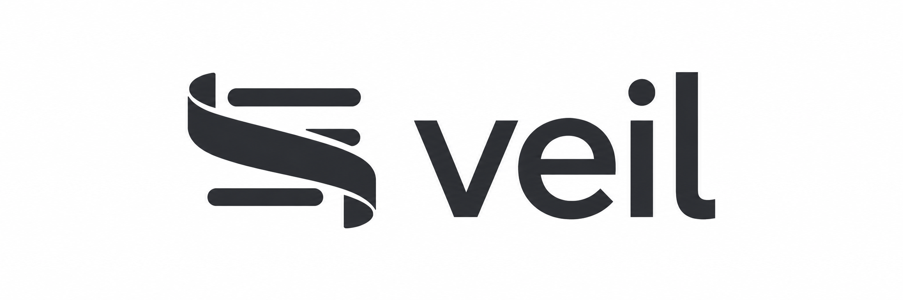

# veil

<p align="center">
  
</p>

**Mask personal information before an AI call. Restore it in the reply.**

Veil runs on your computer. It replaces detected private values with placeholders such as `[EMAIL_1]`, then puts the originals back into the model's response. Use the assistant skill to manage Veil in Codex or Claude Code, or use the Python package with your own AI provider.

**[v0.4.1 · Alpha](CHANGELOG.md) · Python 3.10+ · Dependency-free base library · [MIT](LICENSE)**

[Start with the skill](#start-with-the-veil-skill) · [Python quickstart](#use-veil-in-python) · [What gets masked](#what-veil-detects) · [Troubleshooting](#troubleshooting) · [Road to 1.0](ROADMAP.md)

> These instructions describe this source checkout, including unreleased features. Installing the skill gives your assistant commands for managing Veil. Automatic masking requires a session routed through the Veil gateway. Names need registration; detection can miss values.

## See the round trip

| Stage | Text |
| --- | --- |
| Your input | `Email Jan Nowak at jan.n@example.com.` |
| Sent to the model | `Email [PERSON_1] at [EMAIL_1].` |
| Model reply | `Hi [PERSON_1], following up on the invoice...` |
| Restored locally | `Hi Jan Nowak, following up on the invoice...` |

The name is registered beforehand; email detection is built in. A value keeps its placeholder throughout a conversation. Seeing the original email in your app is expected after restoration; use [verification](#4-verify-your-conversation) to check the round trip.

## Choose your workflow

| You use | Start here | Scope |
| --- | --- | --- |
| Codex desktop, local tasks | [Skill setup below](#start-with-the-veil-skill) | Experimental gateway; restart Codex and open a fresh local task after setup. |
| Codex CLI | `veil codex` | Experimental gateway using your existing ChatGPT login; API-key mode is also available. |
| Claude Code | `veil claude` | Gateway for the newly launched terminal session. |
| Python, scripts, other AI providers | [Python quickstart](#use-veil-in-python) | Works wherever you control the text sent to and received from a model. |
| Ordinary ChatGPT app or browser chats | [Mask and restore copied text](#use-veil-with-chatgpt-and-other-chat-apps) | Explicit text/clipboard workflow; no automatic interception. |
| Other coding assistants | [Integration details](docs/openai-integration.md) | Requires a compatible request/response integration; skill installation alone does not provide one. |

## Start with the Veil skill

The **package** does the masking and restoration. The **skill** lets you ask an assistant to run Veil commands. The **gateway** handles supported model requests from a configured client.

### 1. Install Veil and the skill

Open a terminal in your Veil repository folder. To get a new copy, run `git clone https://github.com/Mpawlowski5467/veil.git`, then `cd veil`. If you are reading an unmerged pull request, use that PR's branch. Published packages may not yet contain these commands.

On macOS/Linux, with Python 3.10+:

```bash
python3 -m venv .venv
source .venv/bin/activate
python -m pip install '.[desktop]'
veil skill install
```

The `desktop` extra supports Codex configuration editing. For Python-only use or Claude Code, `python -m pip install .` is enough. On Windows PowerShell, create the environment with `py -m venv .venv` and activate it with `.venv\Scripts\Activate.ps1`, then run the same install commands.

**Already using uv in this checkout?** Run `uv sync --extra desktop`, then `uv run veil skill install`. You can also prefix the terminal commands below with `uv run` while in this checkout.

The installer reports two locations:

- Codex: `~/.agents/skills/veil`
- Claude Code: `~/.claude/skills/veil`

To install for one client only, use `veil skill install codex` or `veil skill install claude`. Keep the installed Python environment available: the skill remembers its interpreter. [Custom locations, updates, and removal →](docs/assistant-skills.md)

### 2. Ask the skill for setup

These are **chat messages**, not terminal commands. Have your chosen client installed and signed in first.

**Codex desktop:** select **Veil** from the skills picker and send:

```text
Help me set up Veil for Codex desktop.
```

**Codex CLI:** mention the skill with `$veil` (or select it through `/skills`):

```text
$veil help me start a Codex CLI session through Veil
```

**Claude Code:** use `/veil`:

```text
/veil help me start Claude Code through Veil
```

The skill walks through the appropriate setup or gives you the launch command. It cannot reroute a conversation already in progress. If Veil is missing from the picker, start a fresh client session. [More skill examples →](#what-to-ask-the-skill)

### 3. Start a session through Veil

The skill helps with these steps. If you prefer terminal commands, choose **one** route:

| Client | What to do |
| --- | --- |
| Codex desktop on macOS/Linux | Run `veil setup codex`, then `veil start`. Restart Codex and open a **new local task**. |
| Codex CLI | In your project directory, run `veil codex`. Use `veil codex --auth api-key` for an `OPENAI_API_KEY` already set in your shell. |
| Claude Code | In your project directory, run `veil claude`. Use `veil claude --resume` to resume through Veil. |

The CLI launchers keep a private gateway running for that client process and stop it when the process exits. Desktop setup preserves unrelated settings and saves a backup; `veil start` keeps its gateway running after the terminal closes. Automatic startup after reboot is not installed. On Windows, use the [foreground desktop gateway](docs/openai-integration.md#codex-desktop-setup-and-recovery).

Use `veil restart` after changing a desktop gateway's detector settings or upgrading Veil. For CLI workflows, exit and relaunch through Veil. If you chose a custom `--data-dir`, use it consistently for setup, registration, masking, and verification.

[Codex setup, supported features, and undo →](docs/openai-integration.md) · [Background controls and recovery →](docs/background-gateway.md) · [Claude Code details →](docs/claude-code.md)

### 4. Verify your conversation

Inside the **new session you want to test**, select the Veil skill and ask `Verify this conversation through Veil.` In Codex CLI you can send `$veil verify`; in Claude Code send `/veil verify`.

1. The skill creates a one-time prompt containing a fictional email.
2. Send that exact prompt as a **new message in the same conversation** and wait for the reply.
3. Ask the skill to check the verification ID it gave you, for example `Check verification ID <ID>.` Replace `<ID>` with the printed ID.

A **`verified`** result means Veil observed that test request being masked, forwarded, and restored in a completed reply. A reply that merely repeats the email does not prove masking. `pending`, `in_progress`, or `incomplete` are not passes; the skill can explain the next step.

Verification covers that exchange, not all future messages or every kind of private data. Challenges expire after ten minutes. Creating/checking one is local; sending the prompt uses a normal model turn. [Terminal commands, gateway selection, and all result states →](docs/verification.md)

## What to ask the skill

Select **Veil** in Codex desktop, or put `$veil` before a request in Codex CLI and `/veil` before it in Claude Code. These are examples of natural-language requests, not rigid command syntax.

| You want to… | Ask the skill |
| --- | --- |
| Check readiness | `Check Veil status for this client and explain anything I need to fix.` |
| Test a request | `Create a verification prompt for this conversation.` |
| See recent activity | `Show recent Veil activity without private values.` |
| Mask a local draft | `Mask /path/to/draft.txt into /path/to/draft.masked.txt using session email-demo.` |
| Restore a copied model reply | `Restore /path/to/reply.masked.txt into /path/to/reply.txt using session email-demo.` |
| Register a name from a file | `Register the name in /path/to/private-name.txt as PERSON without showing its contents.` |

Replace sample paths with your real local paths. Use the **same data folder and session label** for masking and restoring one conversation. The skill writes restored text to a local file for you to open yourself.

Give the skill **file paths rather than private text pasted into chat**. A skill request is itself sent to the model before any tool can clean it. [How file workflows keep contents local →](docs/assistant-skills.md#keep-file-contents-local)

## Register names and other private values

Names, organizations, and addresses need explicit registration. In your own terminal:

```bash
veil entities add PERSON
veil entities list
```

`add` prompts for one value with typing hidden. `list` shows counts, not the values. Use `veil entities add ORGANIZATION` for an organization, or `veil entities remove PERSON` to remove a registration with the same hidden prompt.

Values are case-sensitive; register each spelling you expect. The gateway also catches known values of at least three characters attached to other text. Restart running gateways or relaunch Veil clients after changing registrations.

The default data folder is `~/.veil`. For another gateway, put `--data-dir /path/to/private-data` **before** the subcommand. Removing a registration does not erase old mappings or client history. [Registration details →](docs/entities.md) · [Custom patterns, settings, and storage →](docs/configuration.md)

## Use Veil in Python

### Mask and restore

This example runs locally without an API key:

```python
from veil import Shield

shield = Shield(redact_warnings=True)
shield.add_entity("Jan Nowak", "PERSON")

masked = shield.mask("Email Jan Nowak at jan.n@example.com.")
if masked.warnings:
    raise RuntimeError("Review masking warnings before sending this text.")

assert masked.text == "Email [PERSON_1] at [EMAIL_1]."
print(masked.text)

# Send masked.text to your model. This is an example reply:
reply = "Hi [PERSON_1], following up on the invoice..."
restored = shield.restore(reply)
if restored.warnings:
    raise RuntimeError("Review restoration warnings before using this reply.")

print(restored.text)
# Hi Jan Nowak, following up on the invoice...
```

Use one `Shield` per conversation. Keep the original text and the placeholder mappings local; send only the masked text to your provider.

<details>
<summary>More Python examples: model wrappers, custom patterns, streaming, and storage</summary>

### Wrap a model call

For a synchronous function that takes a string and returns a string:

```python
from veil import Shield

shield = Shield(redact_warnings=True)
shield.add_entity("Jan Nowak", "PERSON")


def call_model(prompt: str) -> str:
    # Replace this stand-in with your provider's SDK call.
    assert prompt == "Email [PERSON_1] at [EMAIL_1]."
    return "Hi [PERSON_1], following up on the invoice..."


safe_model = shield.wrap(call_model, strict=True)
print(safe_model("Email Jan Nowak at jan.n@example.com."))
```

With `strict=True`, masking warnings raise `ShieldError` before the model is called. Restoration warnings raise after the reply arrives. This catches reported problems; it cannot catch sensitive information the detectors never recognize.

For async calls, structured messages, or tool workflows, use `mask()` and `restore()` at the appropriate boundaries and handle their warnings. `wrap()` is a synchronous text-in, text-out helper.

### Add your own values and patterns

```python
from veil import Shield

shield = Shield(custom_patterns={"ORDER": r"#\d{5}"})
shield.add_entity("Example Corp", "CLIENT")

masked = shield.mask("Order #12345 belongs to Example Corp.")
assert masked.text == "Order [ORDER_1] belongs to [CLIENT_1]."
```

Registered values are case-sensitive. Register each spelling you expect. In the Python library, matches usually respect word boundaries; the gateway adds a pass for known values of at least three characters even when attached to other text.

Custom types use uppercase letters, digits, and underscores, starting with a letter. A custom pattern named after a built-in type replaces that detector's pattern.

### Restore a streaming reply

```python
from veil import Shield

shield = Shield()
shield.mask("Email jan.n@example.com.")

chunks = ["Sent to [EMA", "IL_1]."]
reply = "".join(shield.restore_stream(chunks))

assert reply == "Sent to jan.n@example.com."
```

Placeholders can span chunks. For callback-based streaming and access to restoration warnings, use `stream_restorer()` with `feed()`, `finish()`, and `result()`.

### Keep mappings between runs

```python
from veil import Shield, SQLiteVault

with SQLiteVault("conversations.db", session="chat-42") as vault:
    shield = Shield(vault=vault)
    masked = shield.mask("Email jan.n@example.com.")
    assert masked.text == "Email [EMAIL_1]."

with SQLiteVault("conversations.db", session="chat-42") as vault:
    shield = Shield(vault=vault)
    assert shield.restore("Sent to [EMAIL_1].").text == "Sent to jan.n@example.com."
```

Each session has its own mappings. SQLite supports sharing them across processes. Reapply registered entities and detector configuration when creating a new `Shield`; the vault stores mappings, not configuration. Store the database on a local disk.

See the [Python guide](docs/python-guide.md) for detection rules, opt-in normalization (`normalize=True`), recovery of rewritten placeholders, literal placeholder protection, and custom detector and vault protocols.

</details>

## Use Veil with ChatGPT and other chat apps

For ordinary chat apps that do not route through Veil:

1. Copy your prompt and run `veil mask --session chatgpt-notes --clipboard`.
2. Paste and review the masked text in the chat, then send it. Ask the model to preserve the placeholders.
3. Copy the model's reply and run `veil restore --session chatgpt-notes --clipboard`.
4. Paste the restored text where you need it locally.

Keep the same session label for the conversation and choose a new one for the next conversation. This covers copied text only; attachments, voice, and messages sent without masking are outside the workflow. [Files, clipboard support, and storage →](docs/chat-workflow.md)

## What Veil detects

| Type | Examples and scope |
| --- | --- |
| `EMAIL` | Addresses such as `jan.n@example.com` and `first.last+tag@example.co.uk`. |
| `PHONE` | Supported North American layouts and international numbers with a leading `+` and country code. |
| `IPV4` / `IPV6` | Supported IPv4 and IPv6 address forms. |
| `CREDIT_CARD` | Supported layouts checked against issuer prefixes, lengths, and the Luhn checksum. |
| `IBAN` | Supported country codes and layouts with checksum validation. |
| `SSN` | US numbers with hyphens; compact or space-separated numbers require an explicit SSN label. Invalid area/group/serial ranges are rejected. |
| Your types | Exact registered values or custom regular expressions. |

Detection is based on patterns and explicit registration. Names, organizations, street addresses, and arbitrary secrets are not all discovered automatically. False positives and missed values are possible.

## Understand the boundaries

- **Only detected text is masked.** Unregistered names, unsupported formats, and sensitive context can remain visible.
- **Coverage depends on the adapter.** Images and PDFs pass through the Anthropic adapter; the OpenAI adapter refuses them. Tool definitions are not scrubbed. Hosted search results are outside the Anthropic adapter's coverage, and OpenAI hosted tools are refused.
- **Masking is reversible.** The vault holds original values; placeholders still reveal types, counts, and repeated references. Surrounding context may reveal identity.
- **Tool checks cover arguments containing known values.** Claude uses hooks; the OpenAI gateway checks restored tool inputs before delivery. A command can read and send a file without including its contents in the arguments. Veil is not a sandbox or a network firewall.
- **Your provider still authenticates you.** Masking prompt content does not hide your account or prevent local transcripts.
- **Restoration depends on placeholders surviving.** Unknown placeholders remain unchanged and produce warnings. Use exact restoration (`tolerant=False`) for library output that will be executed or written as tool arguments.
- **Warnings need handling.** Direct `mask()` and `restore()` calls return warnings; `wrap()` emits them by default. Use `strict=True` to raise and `redact_warnings=True` to avoid quoting leaked values in warnings.

## Troubleshooting

| Problem | Next step |
| --- | --- |
| `veil: command not found` | Activate the environment where you installed Veil, or use `uv run veil` from the checkout. |
| The skill is missing | Run `veil skill install` in the correct environment and start a new client session. In Codex use the skills picker or CLI `$veil`; `/veil` is the Claude Code form. |
| The gateway is stopped or unreachable | For a configured Codex desktop worker on macOS/Linux, run `veil start`. For CLI clients, launch with `veil codex` or `veil claude`. Ask the skill to check your selected route. |
| A name remains visible | Register its spelling in the gateway's data folder, then restart/relaunch. Names are not detected automatically. A restored name in the reply is expected. |
| A request is refused | Check the integration's supported features. Veil refuses unsupported request shapes; share a fictional reproduction when reporting a problem. |
| You want ordinary Codex routing back | Run `veil undo codex`, restart Codex, and open a fresh local task. Stop the unused managed worker with `veil stop`. |
| You only want to remove the skill | Run `veil skill uninstall`. This removes the skill, not client routing or stored mappings. |

## Road to version 1.0

The core masking/restoration, local gateways, assistant skills, private registration,
and request verification are implemented in this development checkout. Veil remains
**alpha**, with some features still in review and unreleased.

The next milestone is a small beta: finish integration testing, watch new users
complete setup and normal work, measure detection quality, and address privacy,
storage, and upgrade findings. Stable 1.0 requires the [release gates in the roadmap](ROADMAP.md#10-release-gate).

## Development

```bash
uv sync
uv run pytest -m "not live"
uv run ruff check .
uv run ruff format --check .
uv run mypy --strict src
uv run pyright src
```

The test suite includes Python examples from this README and the Python guide, streaming and overlap tests, gateway tests, and randomized input tests.

Live integration tests require an authenticated Claude Code CLI and make real model calls:

```bash
VEIL_LIVE_CLAUDE=1 uv run pytest -m live
```

## Contributing

Useful contributions include reproducible missed matches, false-positive reports, integration adapters, and tests for new client request formats. Use fictional data when sharing examples.

## License

MIT. See [LICENSE](LICENSE).
See [CHANGELOG.md](CHANGELOG.md) for release history.
