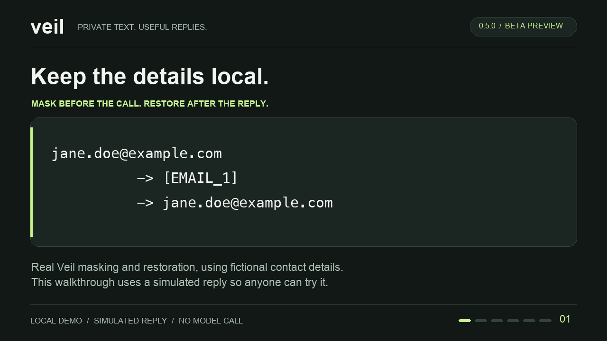

# Your first five minutes with Veil

Try a real masking/restoration round trip on your own computer with **fictional
data, no account, and no API key**. Then, if you use Claude Code or Codex, verify
one real request through the gateway.

Veil 0.6.0b1 is a prerelease. This first local exercise does not change your client
settings or contact a model. Its model reply is explicitly simulated.



[Watch/download the 36-second video](assets/veil-demo.mp4) ·
[Text transcript and runnable example](../examples/first_round_trip.py)

## 1. Install the released version

You need **Python 3.10 or newer**. Create a folder called `veil-try` wherever you
keep projects, and open a terminal in it. These commands install the wheel from
the [0.6.0b1 GitHub release](https://github.com/Mpawlowski5467/veil/releases/tag/v0.6.0b1),
not a similarly named package from a registry.

**macOS / Linux**

```bash
python3 -m venv .venv
source .venv/bin/activate
python -m pip install 'veil[desktop] @ https://github.com/Mpawlowski5467/veil/releases/download/v0.6.0b1/veil-0.6.0b1-py3-none-any.whl'
python -c "import veil; print(veil.__version__)"
```

**Windows PowerShell**

```powershell
py -m venv .venv
.\.venv\Scripts\python.exe -m pip install 'veil[desktop] @ https://github.com/Mpawlowski5467/veil/releases/download/v0.6.0b1/veil-0.6.0b1-py3-none-any.whl'
.\.venv\Scripts\python.exe -c "import veil; print(veil.__version__)"
```

The last line should print **`0.6.0b1`**. The optional `desktop` extra makes Codex
configuration editing available. [Package files and checksums are on the release page.](https://github.com/Mpawlowski5467/veil/releases/tag/v0.6.0b1)

## 2. See the text change and come back

Save the following as **`demo.py`** in the same folder. This uses an in-memory
mapping, so it leaves no Veil vault on disk. Your terminal will show the
fictional values.

```python
from veil import Shield

shield = Shield(redact_warnings=True)
shield.add_entity("Jane Doe", "PERSON")  # Names need registration.
original = "Email Jane Doe at jane.doe@example.com."

masked = shield.mask(original)
if masked.warnings:
    raise RuntimeError("Review masking warnings before sending anything.")

# Simulated reply, not an API call. Keep the placeholders in a real model reply.
reply = "Hi [PERSON_1], I will contact you at [EMAIL_1]."
restored = shield.restore(reply)
if restored.warnings:
    raise RuntimeError("Review restoration warnings before using the reply.")

print("ORIGINAL: ", original)
print("FOR MODEL:", masked.text)
print("SIMULATED:", reply)
print("RESTORED: ", restored.text)
```

Run `python demo.py` on macOS/Linux, or
`.\.venv\Scripts\python.exe demo.py` in Windows PowerShell.

Expected output:

```text
ORIGINAL:  Email Jane Doe at jane.doe@example.com.
FOR MODEL: Email [PERSON_1] at [EMAIL_1].
SIMULATED: Hi [PERSON_1], I will contact you at [EMAIL_1].
RESTORED:  Hi Jane Doe, I will contact you at jane.doe@example.com.
```

That is a successful **local** round trip. A real integration sends `masked.text`
to the model and restores its response with the same mappings. The longer
[runnable demo](../examples/first_round_trip.py) also includes a phone number.

## 3. Optional: try your AI client

This step needs an installed, signed-in client and uses a normal model turn.
Allow extra time if you have not set up that client yet.

Install the helper skill with `veil skill install` (Windows:
`.\.venv\Scripts\veil.exe skill install`). Keep this `.venv` available: the
skill remembers its Python interpreter.

Choose one path:

| Client | Start a new session | Ask in that new session |
| --- | --- | --- |
| Claude Code | Run `veil claude` in your terminal. | `/veil verify` |
| Codex CLI | Run `veil codex` in your terminal. | `$veil verify` |
| Codex desktop | Follow [setup, restart, and recovery](openai-integration.md#codex-desktop-setup-and-recovery), then open a fresh local task. | Select Veil from the skills picker and ask `Verify this conversation through Veil.` |

On Windows, use `.\.venv\Scripts\veil.exe` in place of the terminal command
`veil`. Desktop gateway operation on Windows uses a foreground terminal; the
background `start` command is limited to macOS/Linux. Codex integration remains
experimental. If a terminal command is unavailable from another project folder,
use the full path to the `veil` executable in your `veil-try/.venv` directory.

The skill gives you a one-time prompt and a verification ID:

1. Send the **exact generated prompt** as a new message in the same conversation.
2. Wait for the reply to finish.
3. Ask `Check verification ID <ID>.`, replacing `<ID>` with the actual ID.

Success is **`verified`**, with masking, forwarding, restoration, and completion
all observed. An echoed email alone is not proof. A pending or incomplete result
needs investigation; [the verification guide](verification.md) explains each state.
This evidence covers that exchange, not every message or every kind of data.

Installing the skill does not turn on routing. Avoid pasting real private values
into an unverified chat; for local drafts, give the skill a file path instead.
The [official Codex skill guide](https://learn.chatgpt.com/docs/build-skills#how-codex-uses-skills)
explains skill selection and mentions.

Using Python or another provider? Continue with the [Python guide](python-guide.md).
Using an ordinary ChatGPT app/browser chat? Use the explicit [clipboard workflow](chat-workflow.md).

## 4. Tell us how it went

[Send beta feedback](https://github.com/Mpawlowski5467/veil/issues/new?template=beta-feedback.yml)
whether it worked or failed. Include your OS, Python/client versions, whether
you got the expected output, and the first confusing step. Fictional examples
are enough; never attach credentials, real personal data, vaults, or transcripts.

If you are stopping after step 2, you have not changed any client routing or
installed a skill. If you tried the integration, use the [removal instructions](assistant-skills.md#update-or-remove)
and [Codex recovery guide](openai-integration.md#codex-desktop-setup-and-recovery)
before removing the environment. Closing a CLI session stops its launcher gateway.

## What this test does not promise

Names need registration; detectors can miss values. Persistent mappings are
plaintext with private file permissions/Windows ACLs. Claude images/PDFs pass
through unmasked; the OpenAI adapter refuses media. Client transcripts and
traffic outside the supported gateway boundary have separate risks. See the
[compatibility matrix](compatibility.md) and [threat model](threat-model.md).
